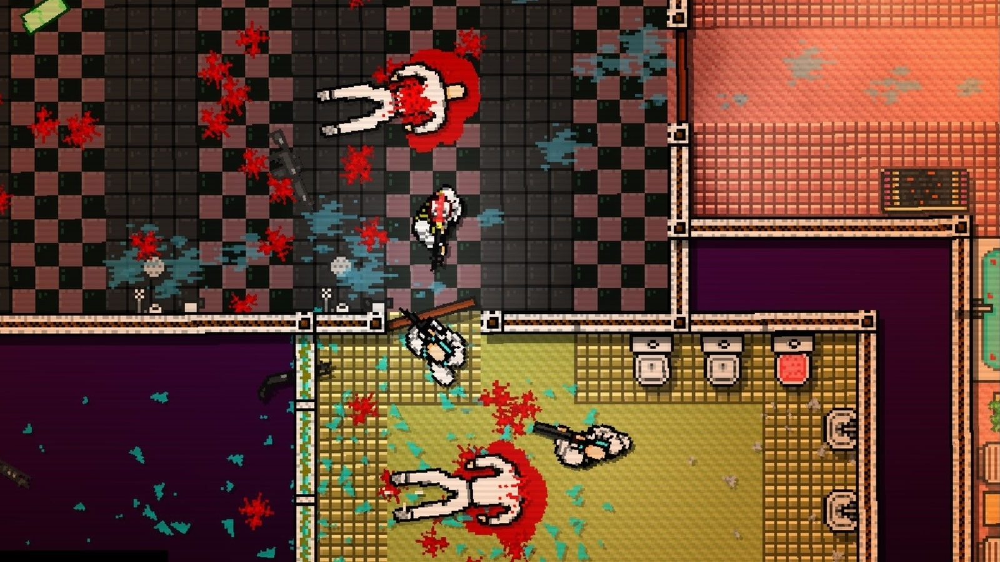
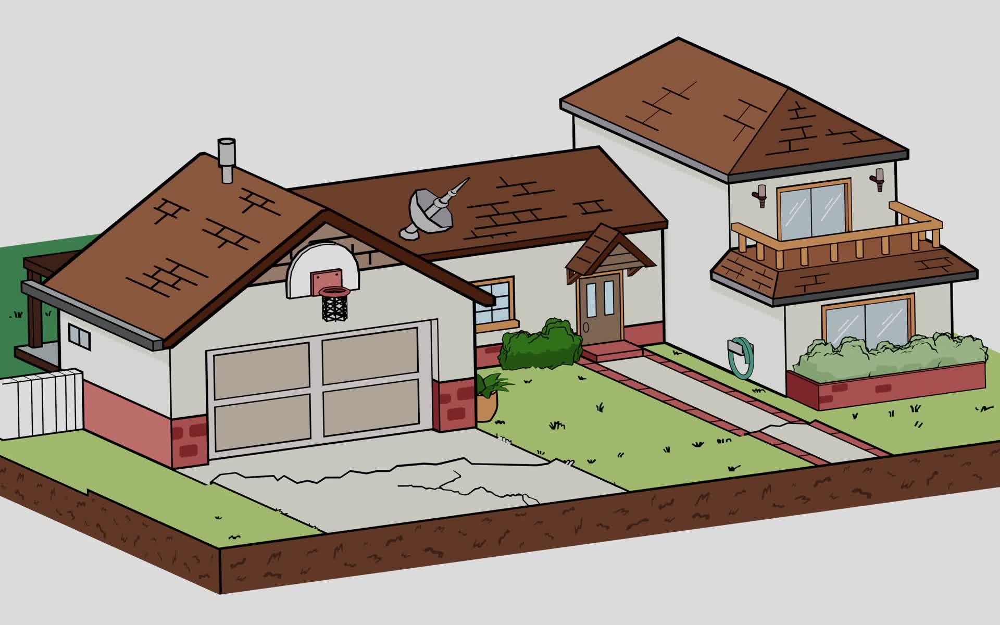
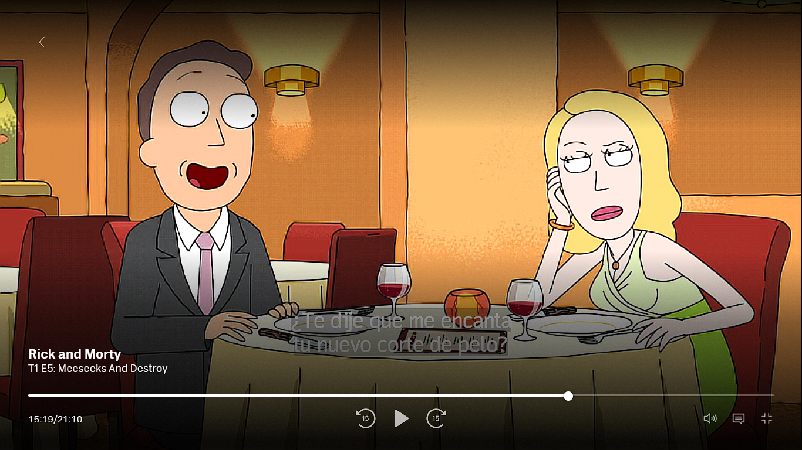
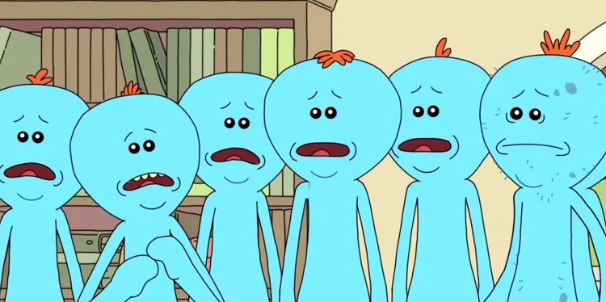

# Ideas Proyecto Informática II

## Integrantes
* Felipe Jiménez Ramírez
* Santiago Pareja Pareja

## Episodio base:
* Rick and Morty Episodio 5 Temporada 1 

## Posibles nombres del juego:

* Intruder
* Intruder: Rick and Morty Adventure
* Meeseeks Invasion

# Clalificación
PG 16

## Historia del episodio:

El episodio trata sobre unas criaturas llamadas Meeseeks, quienes fueron creadas para realizar una tarea en específico y después morir, Rick y Morty deciden ir de aventura a otra dimensión, mientras que el resto de la familia hacían uso de una caja generadora de Meeseeks para realizar varias tareas. El problema empieza cuando Jerry, el papá de Morty desea mejorar su técnica de golf, pero estas criaturas se ven incapaces de ayudar en esta tarea, todo termina por descontrolarse al punto de que un Meeseek busca ayuda en otro de su misma especie, hasta que les da una crisis existencial y deciden matar a Jerry, ya que este era incapaz de lograr su objetivo, para acabar con su tormento, finalmente Jerry logra mejorar su técnica haciendo que todos los Meeseeks desaparezcan.

## Argumento del videojuego:

El videojuego Intruder funciona a modo de spinoff o what if, en el que los Meeseeks terminan por convertirse en una plaga que se extendería a lo largo del mundo, el episodio transcurre igual hasta los compases finales, pero a diferencia del original, los Meeseeks lograron matar a Jerry, pero se dieron cuenta de que esta acción no era la solución del problema, y en búsqueda de un sentido de su existencia, decidieron tomar la vida de la humanidad.

Después de la muerte de Jerry, Rick influenciado por Morty decide tomar venganza ante lo sucedido y acabar con la plaga Meeseeks, durante el juego el personaje 
jugable será Rick y tendrá como tarea acabar con los Meeseeks que se interpongan en su camino.

## Mécanicas del juego:

#### *Tipo de vista*: Cenital

#### *Juego en el que nos basamos*:

* Hotline Miami

[Enlace Video](https://www.youtube.com/watch?v=fGzsLU4slGk) 
Como se logra ver, este juego tiene vista cenital y de él tomamos varias ideas para el desarollo del juego.

### *Escenarios*:

* Pueblo:

* Restaurante:

 
### *Combate*:
El tipo de combate que deseamos implementar es de tipo melee, que en pocas es combate mano a mano o dicho de otra manera cuerpo a cuerpo, en ese orden de ideas, los ataques disponibles serían un golpe convencional y el uso de un bate, también se desea incluir una modalidad tipo glory kill, la cuál se basa en un tipo de remate, por otra parte se utilizará sangre durante el combate y asesinato de Meeseeks.

## *Enemigos*:
 
Los enemigos serán los Meeseeks, que como se logra observar son el mismo modelo, pero con algunos cambios, lo cual vuelve más sencillao el proceso de creación de los sprites.